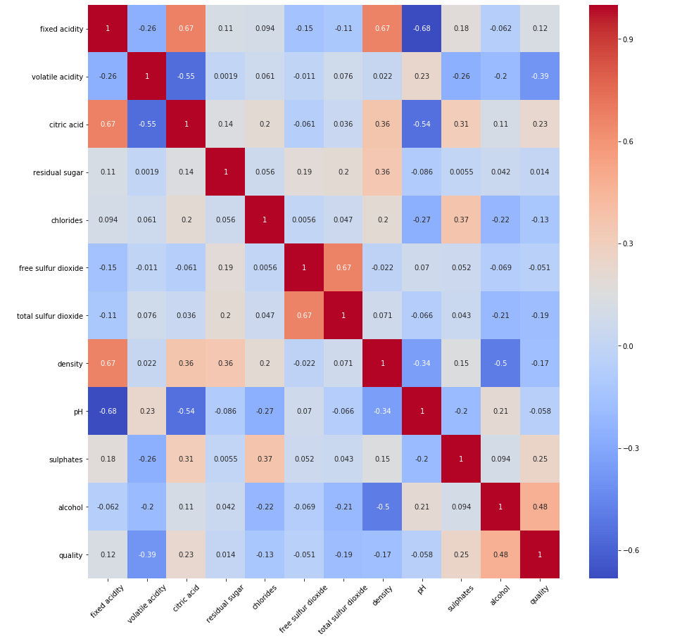

# Wine Quality Prediction
Wine Quality Prediction Project
## Table of contents
* [Introduction](#introduction)
* [Technologies](#technologies)
* [Goal](#goal)
* [Dataset](#dataset)
* [Methodology](#methodology)
* [Models Used](#models-used)
* [Model Results and Selection](#model-results-and-selection)
## Introduction
I was first introduced to wine during a wine tasting trip I took to Italy in 2010. We visited many cities such as; Milan, Florence, Tuscany, Venice, etc. in which we visited vineyards, drank wine, ate good food, and were taught about the wine making process. Through my experience in Italy, I became a fan of wine specifically red wine. I wanted to take a deeper dive into what the components are for a high quality wine. 
## Technologies
Python
## Goal
The goal for this analysis is to be able to predict the quality of wine based on certain attributes.
## Dataset
The dataset can be found here:
 
https://archive.ics.uci.edu/ml/datasets/wine+quality 
 
The data includes 1,599 observations and the following variables: 
 
**fixed acidity:** The predominant fixed acids found in wines are tartaric, malic, citric, and succinic. Wines produced from cool climate grapes are high in acidity and thus taste sour. These high-acid wines can be treated to reduce the acidity.
 
**volatile acidity:** Acetic acid, which is also the primary acid associated with the smell and taste of vinegar.
 
**citric acid:** An acid supplement during the fermentation process to help winemakers boost the acidity of their wine especially grapes grown in warmer climates.
 
**residual sugar:** Natural grape sugars leftover in a wine after the alcoholic fermentation finishes.
 
**chlorides:** Contributes to potential salty taste in wine.
 
**free sulfur dioxide:** Measure of the amount of SO2 that is not bound to other molecules. Sulfur Dioxide is used throughout all stages of the winemaking process to prevent oxidation and microbial growth.
 
**total sulfur dioxide:** The portion of SO2 that is free in the wine plus the portion that is bound to other chemicals in the wine such as aldehydes, pigments, or sugars.
 
**density:** Density of wine is primarily determined by the concentration of alcohol, sugar, glycerol, and other dissolved solids.
 
**pH:** Way to measure ripeness in relation to acidity.
 
**sulphates:** Food preservative widely used in winemaking in order to maintain the flavor and freshness.
 
**alcohol:** The amount of alcohol the wine contains.
 
**quality:** How the wine is rated. In this dataset the lowest quality is 3 while the highest is 8.

## Methodology
1. *Data Understanding and Data Cleaning:* Lengths and types of the variables were determined and data was checked for missing values. The dataset consists of all numeric variables. The dataset doesn't contain missing values.

2. *Exploratory Analysis:* Created visualizations to explore the target variable and examine the potential existance of outliers or corrupt data. Further visualized the relationship between the target and the feature variables and relationships between features. 

First, I examined the target variable, quality. The average of wines in this dataset are rated 5 or 6 and target variable is normally distributed.
  

Second, a distribution plot and a box plot was created to examine the distribution of each feature and the interaction between feature and target respectively. 
  

Lastly, a heatmap was created to further examine the degree of correlation between varibles.
  

The highest positively correlated variables are:
* citric acid and fixed acidity
* density and fixed acidity
* alcohol and quality  

The highest negatively correlated variables are:
* citric acid and volatile acidity
* pH and fixed acidity
* pH and citric acidity
* denisty and alcohol  

3. *Feature Selection and Feature Engineering:* Removed features that could potentially create noise and accessed the validity of removal through backward elimination and feature importance. Used ordinal encoding on degree and job type and one-hot encoding on major and industry in order to be used in the model and applied standardization to ensure that one feature doesn't influence the model more than the others.

4. *Model Building and Evaluation:* Established a Baseline Model, using Linear Regreesion, and evaluated based on MSE and R-squared. Developed 3 other models in order to improve upon baseline model.  
 
5. *Scoring the Dataset:* Model with lowest MSE and highest R-squared was selected for salary prediction.The baseline model results were and R-sqaured of 74% and a MSE of 395.
## Models Used
Linear Regression: Baseline
 
Polynomial Transformation: When I plotted the model previously, the data showed some curvature. If we applyed polynomial transformation to the features, a quadratic curve will potentionally fit the data better than a linear one.
 
Ridge Regression: Since the data potentially displays multicollinearity or highly corrleated features, specifically between major and degree, I decided to try this model.
 
Random Forest: Since the data consists of largely categorical features, I choose this model to see if it would perform better.
## Model Results and Selection
**Linear regression with 2nd order polynomial transformation gave the best prediction of salary with MSE of 357 and R-squared of 76%.**
*Ridge Regression also showed MSE of 357, but a R-squared of slightly lower at 73%.
Random Forest resulted in the worse MSE of 372 and R-squared of 75%.* 
 
The distribution plot for the choosen model shows that the predicted values are very close to the actual values with a bit of an overestimation in salaries from $105,000 to $150,000. 
 
The plot below demostrates the level of importance of each feature on salary. The feature with the highest influence on Salary is job type.
 
